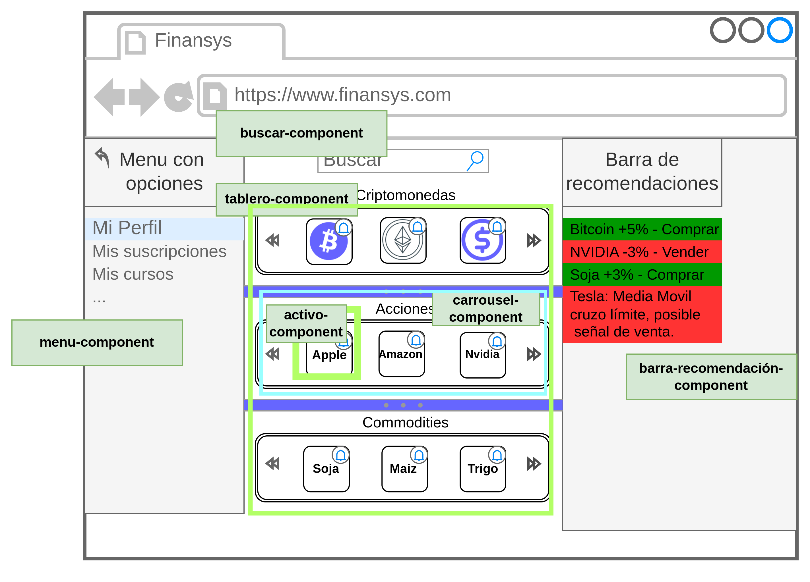

<h1 align="center">
  
  <p align="center">Universidad Tecnologica Nacional</p>
</h1>

# Proyecto Final
Repositorio para la entrega del proyecto final de ISI de la Universidad Tecnológica Nacional

# Fronted

*Rama: frontend_angular*

En esta rama esta la programación del frontend de la aplicación, la descripción de los componentes principales de la interfaz de usuario y los pasos necesarios para la instalación de este en **localhost:4200**.

## To-do📋
1. Hacer la instalación de todo lo necesario en local.
2. Ver como se hace la instalación de Auto0


## Dependencias 🛠️:
1. Node
2. Angular

Dependencias de Angular
1. Bootstrap
2. Auth0

### Node 🚀

* [Instalación desde Pagina Oficial ️️️️️⚡️](https://nodejs.org/es/)

### Angular 🚀

* Instalar con Node:[ Pagina Oficial ⚡️](https://angular.io/start)

> Agregar Angular como dependencia al proyecto 🔧

```
npm install -g @angular/cli
```

> Crear proyecto y desplegarlo
```
ng new my-app
cd my-app
ng serve –open 
```

_The - -open (or just -o) option automatically opens your browser to http:/localhost:4200._


> Agregar un nuevo componente  🔧
```
ng generate component nombre-componente
```

## Diseño 



Main component
1. menu-component
2. buscar-component
3. barra-recomendaciones-component
4. tablero-component
    1. carrousel-activos-component (Un carrousel por tipo de actico: Accion, Cripto, etc.)
        1. activo-component

Componente de Auth0
